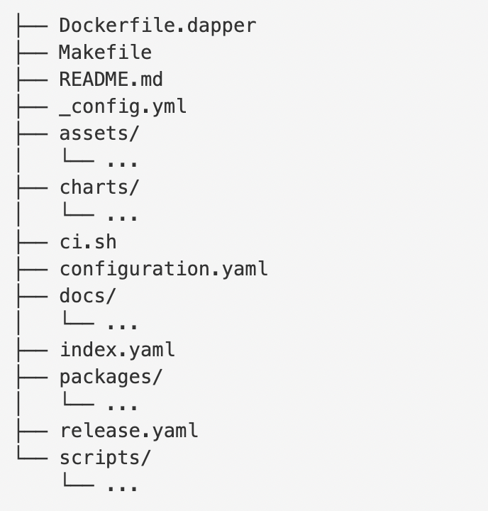
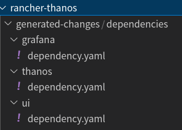

# pandaria-catalog 仓库维护手册

## 目录结构



pandaria-catalog 仓库的目录结构可参考 [rancher/charts](https://github.com/rancher/charts) 仓库。

- `assets/` 存放 `make charts` 生成的 `tgz` 包以及 `icon` 等资源文件。
- `charts/` 目录存放由 `make charts` 或 `make validate` 生成的 `charts` 的代码。
- `packages/` 存放 package 的信息，每个 package 的文件夹中包含 `package.yaml` 定义该 package 的代码链接 `url` 以及版本号 `version`、工作目录 `workingDir`。
- `docs/` 存放文档。
- `scripts` 存放 `charts-build-script` 脚本。

## Developing

> 此部分可参考英文版 [Developing](developing.md) 文档。

### 为 pandaria-catalog 仓库添加新的 package

添加新的 package 通常需要以下步骤：

1. 在 `packages` 中新建文件夹并在其中创建 `package.yaml`。

    ```sh
    PACKAGE=<packageName> # can be nested, e.g. rancher-monitoring/rancher-windows-exporter is acceptable
    mkdir packages/${PACKAGE}
    touch packages/${PACKAGE}/package.yaml
    mkdir packages/${PACKAGE}/v${VERSION} # semantic version of the chart
    ```

2. `package.yaml` 中填写的配置在[英文文档](packages.md)中有详细介绍。

    ```yaml
    url: local              # 表示 charts 的代码存储在本地，不需要从网络上下载
    workingDir: "v0.0.9"    # charts 文件所在的目录名称，默认为 charts
    version: 0.0.9          # charts 的版本号，该参数将覆盖 Charts.yaml 中的设置。
    ```

3. 将 Charts 的代码放在 `workingDir` 对应的目录下面，本例中为 `v0.0.9/`。

> 如果 Charts 中含有子 Charts （依赖），请按照下方的 **[子 Chart / 依赖的维护](#%E5%AD%90-chart--%E4%BE%9D%E8%B5%96%E7%9A%84%E7%BB%B4%E6%8A%A4)** 中介绍的步骤进行维护。

### 修改现有的 Package

修改本仓库中的 `Package` 需要以下几步：

1. 设置环境变量 `export PACKAGE=<packageName>`
   （不设置环境变量将默认修改所有的 `Packages`）
2. 修改 `Package` 代码后，编辑 `package.yaml` 中的版本号，发布新的版本。
    本仓库中，如果下载了新版本 Charts 的代码，本仓库的维护方法是，在该 `Package` 目录下使用新的版本号新建一个文件夹(`vX.Y.Z`)，之后修改 `package.yaml` 中的 `workingDir` 和 `version` 为对应的新版本 Charts 的代码所在目录和版本号。
3. 因为本仓库 `Package` 的 `url` 均为 `local`，因此可不用执行 `make prepare`, `make patch` 和 `make clean`。
4. 当 `Package` 修改完毕，执行 `make charts`，这将生成一个名为 `assets/${PACKAGE}/${CHART}-${VERSION}.tgz` 的压缩包，并创建 `charts/${PACKAGE}/${CHART}/${VERSION}/` 目录存放 Charts 的代码，并更新 `index.yaml` 文件。
    首次执行 `make charts` 会生成大量的未被 Git 暂存的文件，为了方便 review，建议单独为 `make charts` 编写一条 commit 记录。

### 子 Chart / 依赖的维护

在引入 charts-build-scripts 机制之前，子 Chart 的代码是存放在父 Chart 的 `charts/` 目录下面，引入 charts-build-scripts 机制后，请勿将子 Chart 的代码直接存放在 Package 的 Chart 的代码文件夹的 `charts/` 目录下面，而是 **将子 chart 作为单独的 Package 进行维护**。

1. 首先为子 Chart 创建 Package。

    ```sh
    CPACKAGE=<CHILDREN_PACKAGE_NAME> # 子 chart 的 Package Name
    mkdir -p packages/${CPACKAGE}/v${CVERSION}/charts
    vim packages/${CPACKAGE}/v${CVERSION}/package.yaml
    ```
1. 编辑 `package.yaml`。

    ```yaml
    url: local
    workingDir: "charts"    # not required, default is `charts`
    version: 0.0.1          # not required
    doNotRelease: true      # required, do not create tgz tarball for this package
    ```

    其中，`workingDir` 和 `version` 可以省略，`doNotRelease` 设定为 `true` 是因为这个 Package 只用来作为其他 Chart 的依赖，因此 charts-build-scripts 将不会发布这个 Package。

1. 在父 Chart 的 Package 目录中建立 `generated-changes/dependencies/` 目录，指明父 Chart 与子 Chart 之间的依赖关系。

    ```sh
    FPACKAGE=<FATHER_PACKAGE_NAME> # 父 Chart 的 Package Name
    CPACKAGE=<CHILDREN_PACKAGE_NAME> # 子 Chart 的 Package Name
    mkdir -p packages/${FPACKAGE}/generated-changes/dependencies/${CPACKAGE}/
    vim packages/${FPACKAGE}/generated-changes/dependencies/${CPACKAGE}/dependency.yaml
    ```

1. 编辑 `dependency.yaml`

    ```yaml
    workingDir: ""                  # empty string
    url: packages/grafana/v0.0.4    # the path to the package
    doNotRelease: true
    ```

1. 之后执行 `make charts`, `charts-build-scripts` 会为生成的 Chart 代码中建立子 Chart 的目录，并建立依赖关系。

> 关于 package 中的依赖关系是如何建立的，可参考本仓库已有的 `rancher-thanos` 与 `grafana`, `thanos`, `thanos-ui` 之间的依赖关系是如何建立的。



### 移除已发布的 Charts & Packages

`charts-build-scripts` 使用 `make remove` 命令移除已发布的 charts，执行此命令需要手动标识 `CHART=<chart name>` 和 `VERSION=<version>` 两个环境变量。
例如删除所有已发布的名为 `xsky` 的 charts，执行以下命令：

```sh
CHART=xsky VERSION=2.0.1 make remove
CHART=xsky VERSION=2.1.0 make remove
CHART=xsky VERSION=2.2.0 make remove
```

> `VERSION` 版本号可以在 `charts/<chart-name>/` 目录下获取到，比如想要删除的应用对应的目录为 `charts/xsky/2.2.0/`，那么 `VERSION=2.2.0`。

以上样例中的命令将删除 `assets/xsky` 目录下对应版本的 `tgz` 包，同时删除 `charts/xsky` 目录下的对应版本的 chart 的文件。

在删除 charts 后，还需要手动删除 `packages/xsky` 目录下对应的文件，否则重新执行 `make charts` 会再次重新在 `assets/` 目录下生成 `tgz` 包，并在 `charts/` 目录下生成应用的代码。

## Validation / CI

> 此部分参考英文版 [Validation](validation.md) 文档。

在 CI pipeline 中运行的 `make validate` 执行以下几个步骤：

1. 确保 Git 工作目录干净，否则验证失败。
2. 执行 `make charts`, 如果执行后 Git 工作目录不干净，那么验证失败。
3. 当 `configuration.yaml` 中配置了 `validate.url` 和 `validate.branch` 时，拉取这个上游 Git 仓库，对比上游和本地仓库的资源文件 (assets)：
    1. 对比本地的资源文件和上游的资源文件是否相同。
    1. 如果本地与上游不相同，检查这个资源文件所对应的 Charts 版本是否在 `release.yaml` 中。
    1. **本仓库暂未启用检测本地的资源文件与上游的资源文件是否相同的验证机制。**
4. 执行 `make unzip`, 如果 Git 工作目录不干净，那么验证失败。

> 建议在提交 PR / Commit 之前，先手动在本地执行一遍 `make validate`，在确保本地执行 `make validate` 通过后再提交 PR，以避免 CI Check 失败。

<!--
### release.yaml

当 `configuration.yaml` 中存在 `validate.url` 和 `validate.branch` 配置时，`make validate` 会自动生成一个 `release.yaml`，表示本地与上游存在差异的 Charts。

`make validate` 的目的是为了确保本地的改动不会对上游仓库的 `charts/`, `assets/` 和 `index.yaml` 产生改动，然而有一种情况是，当对上游仓库添加新的 Package 或修改已有的 Package 时，就存在这种影响。因此需要在 `release.yaml` 中标注存在改动的 Charts。因此当修改或添加一个新的 Charts 后，要在 `release.yaml` 中标识与上游不同步的 Charts 的版本号。

格式例如：

```yaml
<chart>:
- <version>
- <version>
- ...
rancher-monitoring:
- 100.0.0+up16.6.0
rancher-monitoring-crd:
- 100.0.0+up16.6.0
```
-->

## Example

假设正在为名为 `my-chart` 的 Charts 添加新的版本 `0.1.2-rc4`，上游和本地现有的版本为 `0.1.2-rc3`，按照上述逻辑，需要执行以下几个步骤:

1. 在 `my-chart` 的 Package 目录下创建新的 `v0.1.2-rc4` 目录存放 Chart 代码。
2. 修改 `package.yaml` 中的 `version` 和 `workingDir` 为对应的版本 `0.1.2-rc4`。
3. 执行 `make charts`，在 `charts` 目录中生成对应的 Charts 的代码，并在 `assets` 目录创建 tgz 包。
4. 将所有改动提交 commit 使 Git 工作目录干净，执行 `make validate`，以确保 CI check 不会失败。
5. 提交 PR。

----

假设 PR merge 后，你打算删除 `my-chart` 的 `0.1.2-rc3` 版本，只保留 `0.1.2-rc4`，需要执行以下步骤：

1. 执行 `CHART=my-chart VERSION=0.1.2-rc3 make remove`，这将删除 `charts/my-chart` 目录下版本号为 `0.1.2-rc3` 的代码，并删除 `assets/my-chart` 中版本号为 `0.1.2-rc3` 的 tgz 包。
2. 将所有改动提交 commit，确保 Git 工作目录干净，执行 `make validate`，确保 CI check 不会失败。
3. 提交PR。

## Note

`charts-build-script` 无法识别以英文字母开头的 [Semantic](https://semver.org/) 版本号，所以每个 Chart 的 `Chart.yaml` 中版本号 `version` 不能以英文字母开头，否则 `charts-build-script` 会认为这是非法的命名，例如：

``` yaml
version: 1.2.3      # valid
version: v1.2.3     # invalid
```
